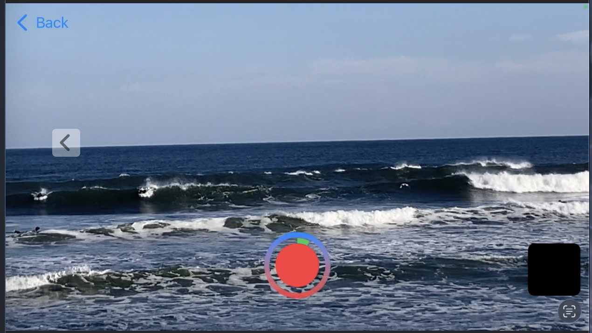

# 🌊 World Wide Wave

This app is available on the appstore.
It showcases the features and UI elements that have been completed so far, without including any private assets.
This branch will be updated whenever the main branch receives major updates.

このアプリはアップstoreでインストール可能です。
これまでに完成している機能や UI を、プライベートなデータを含めずにまとめています。
mainブランチに大きな更新が入ったときに随時更新されます。

---

## 📲 Overview

World Wide Wave is an ios app built using Swiftui and Uikit.
It allows users to explore wave information, map interactions, and 
view visual elements.

World Wide Wave は SwiftUI と UIKit を使用して開発された iOS アプリです。
波の情報確認、地図上のインタラクション、ビジュアル UI などを備えています。

### 🛠 Key Features (MVP)

- Record surf locations and conditions with photos/videos　and information form. 
- Long-press to register new points via MapKit.
- Intergration of SwiftUI views and UIkit controllers.

- サーフィンの位置やコンディションを写真/ビデオとインフォメーションフォームで記録します。
- MapKitを活用し、長押しで新規ポイントを登録可能。
- SwiftUIとUIKitを組み合わせた設計。

## ⚙️features

### Login view

- Authentication view for Apple users only.

- Apple でサインイン専用の認証画面です。

  

File:[LoginViewController.swift](./World%20Wide%20Wave/LoginViewController.swift)

---

### MapView(Surf Point Registration)

</a> 

Users can long-press on the map to register surf point location.

- マップを長押しすることで、新しいサーフポイントを登録できます。
- UIViewControllerRepresentable を用いて UIKit SwiftUI を連携させ、画面遷移を実装しています。
- MapKit については UIKit のクラスを利用することで、より細かい UI カスタマイズを実現しています。 SwiftUI だけでは難しい MapKit の細かい UI カスタマイズを実現するため、UIKit を併用しています。

　

Flie: [WaveMapViewController](./World%20Wide%20Wave/WaveMap/mapView/WaveMapViewController.swift)

File: [WaveInfoSwifUIViewController](./World%20Wide%20Wave/WaveMap/mapView/WaveMapViewController.swift) 

### MylogView(Coleection of User's Wave Logs)

Users can view a list of their recorded wave logs from the other tabs.

他のタブ画面(Mapview)で記録した波ログを一覧で確認できます。

Flie:
    [MylogSwiftUiView](./World%20Wide%20Wave/myLog/MylogSwiftUIView.swift)
 

### Camera fundction

  
  

