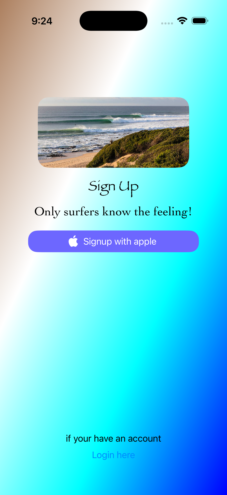

# World Wide Wave (Portfolio Branch)

This branch contains the portfolio version of the world wide wave ios app.
This portfolio showcases the features and UI elements
completed so far, without includng amy privage asset.
This branch will update when the main branch has updated.

--

## 📲 Overview
World Wide Wave is an ios app built using Swiftui and Uikit.
It allows users to explore wave information, map interactions, and 
visual elements.

This portfolio branch:

- Demonstrates selected featres with mock assets.
- Includes screenshots and brief descriptions.

--

###🪡 Feature

**Login view**
Authentication view for Apple users only.

File: [LoginViewController.swift](World%2Wide%2Wave%/LoginViewController.swift)

- **MapView (Surf point Registration)**
  Users cand long-press on the map to register surf point location.

