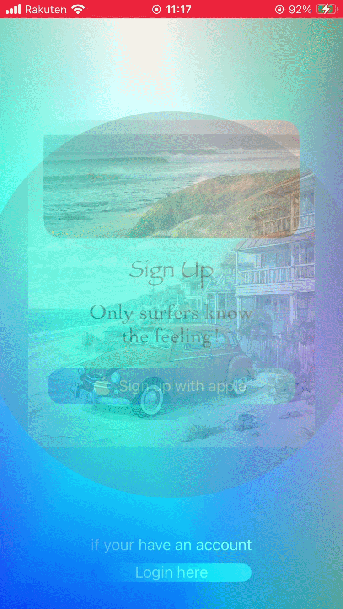
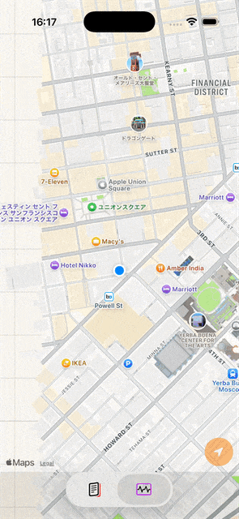
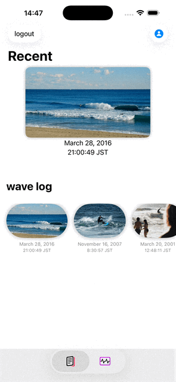
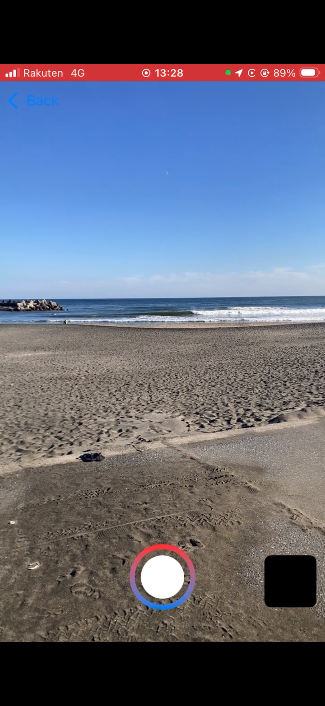
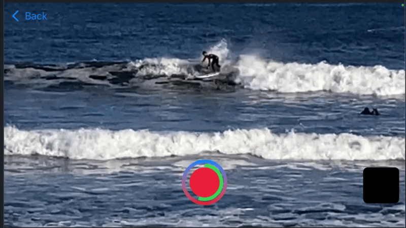

# 🌊 World Wide Wave
link to the app↓

[](https://apps.apple.com/us/app/world-wide-wave/id6758753103)

This app is available on the appstore.
It showcases the features and UI elements that have been completed so far, without including any private assets.
This branch will be updated whenever the main branch receives major updates.

このアプリはアップstoreでインストール可能です。
これまでに完成している機能や UI を、プライベートなデータを含めずにまとめています。
mainブランチに大きな更新が入ったときに随時更新されます。

---

## 🎬 App Demo
 
 
 

---

## 📲 Overview

World Wide Wave is an ios app built using Swiftui and Uikit.

This app allows users to 
- Record surf condition
- Pin surf point on a map
- Log wave conditions using a condition list with photos or videos.
- Manage surf logs in a visual interface


World Wide Wave は SwiftUI と UIKit を使用して開発された iOS アプリです。

このアプリでは以下が可能です。
- サーフコンディションを記録
- 地図上にサーフポイントをピン留め
- コンディションリストと写真・動画を使って波の状態を記録
- 視覚的なインターフェースでサーフログを管理

---

## 🏗 Architecture

This project follows the MVVM architecture pattern.

このプロジェクトではMVVMアーキテクチャを採用しています。

--- 
```
View (SwiftUI / UIKit)
        │
        ▼
ViewModel (State / FormData)
        │
        ▼
Model (SwiftData)
        │
        ▼
Persistence (CloudKit)
```
---

### Model

Implemented using SwiftData @Model
- SurfLog2
- userData

Stores surf session information such as:
- location
- wave condition
- wind / tide
- photos and videos
- generated video thumbnails
- user data

### ViewModel

Implemented using FormData
- FormData

Manages form and user input such as:
- form validation
- thumbnail generation
- media processing
- saving data to SwiftData
- Video thumbnails are generated using AVFoundation.

### View

SwiftUI views render the UI Nd react to ViewModel state.
Examples:
- FormViewModel 

View receive state from the ViewModel using @EnvironmentObject.

File:[LoginViewController.swift](./World%20Wide%20Wave/Struct_tools.swift)

---

## Tech Stack
<a href="#">
      
</a>

---


## 🛠 Key Features (MVP)

###SurfLog Recording

user can record surf seddions including:
- location
- wave conditions
- wind and tide
- photos and videos

サーフセッションの情報を記録できます。
- 位置情報
- 波のサイズやコンディション
- 風や潮位
- 写真 / 動画

### Map Interaction

Users can long-press the map to register surf points.

MapKit is implemented using UIKit to achieve deeper UI customization.

ユーザーは マップを長押しすることでサーフポイントを登録できます。

MapKit の細かい UI カスタマイズを実現するため、UIKit を併用しています。

File:[LoginViewController.swift](./World%20Wide%20Wave/WaveMap/mapView/WaveMapViewController.swift)

### Surf Log List

User can view previously recorded surf logs.

SwiftData and CloudKit is used to local persistence.

ユーザーが記録したサーフログを一覧表示できます。

SwiftData を利用してログを保存しています。

File:[LoginViewController.swift](./World%20Wide%20Wave/mylog)

### Custom Camera Systen

This app implements a custom camera and video recording system using AVFoundation.

Features:
- photo capture
- video recording
- landscape video support
- automatic video thumbnail generation

AVFoundation を使用して独自のカメラ機能を実装しています。

機能:
- 写真撮影
- 動画撮影
- 横画面動画対応
- 動画サムネイル自動生成

 


File:[LoginViewController.swift](./World%20Wide%20Wave/WaveMap/infoView/unified_camera)

---

## 📂 Project Structure

---
```
WorldWideWave
│
├─ WaveMap
│   ├─ mapView
│   │   └─ WaveMapViewController.swift
│   │
│   └─ infoView
│       ├─ unified_camera
│       │   └─ UnifiedCameraSwiftUIView.swift
│       │
│       └─ WaveInfoSwiftUIView.swift
│
├─ myLog
│   └─ MylogSwiftUIView.swift
│
├─ Login
│   └─ LoginViewController.swift
│
└─ Models
    ├─ SurfLog2.swift
    └─ UserData.swift
```
--- 

## 🚀 Future Improvements

- Cloud synchronization improvements
- Advanced wave analytics
- Community surf point sharing
- Apple Watch integration

- Cloud同期の改善
- 波データ分析機能
- サーフポイント共有機能
- Apple Watch対応

 ---
 
 
 
 
 
 
 
 
 
- Record surf locations and conditions with photos/videos　and information form. 
- Long-press to register new points via MapKit.
- Intergration of SwiftUI views and UIkit controllers.

- サーフィンの位置やコンディションを写真/ビデオとインフォメーションフォームで記録します。
- MapKitを活用し、長押しで新規ポイントを登録可能。
- SwiftUIとUIKitを組み合わせた設計。


## ⚙️features


### Login view

<a href="#"> 
</a>


- Authentication view for Apple users only.

- Apple でサインイン専用の認証画面です。

 

File:[LoginViewController.swift](./World%20Wide%20Wave/LoginViewController.swift)


---


### MapView(Surf Point Registration)

</a> <a href="#">
  
</a>

Users can long-press on the map to register surf point location.

- マップを長押しすることで、新しいサーフポイントを登録できます。
- UIViewControllerRepresentable を用いて UIKit SwiftUI を連携させ、画面遷移を実装しています。
- MapKit については UIKit のクラスを利用することで、より細かい UI カスタマイズを実現しています。 SwiftUI だけでは難しい MapKit の細かい UI カスタマイズを実現するため、UIKit を併用しています。


Flie: [WaveMapViewController](./World%20Wide%20Wave/WaveMap/mapView/WaveMapViewController.swift)

File: [WaveInfoSwifUIViewController](./World%20Wide%20Wave/WaveMap/mapView/WaveMapViewController.swift) 


### MylogView(Coleection of User's Wave Logs)


Users can view a list of their recorded wave logs from the other tabs.

他のタブ画面(Mapview)で記録した波ログを一覧で確認できます。


Flie:
    [MylogSwiftUiView](./World%20Wide%20Wave/myLog/MylogSwiftUIView.swift)
 

### Camera fundction
</a> <a href="#">

</a>
- This application implements a custom camera and video recording system using AVFoundation.  
Landscape video recording is fully supported for a more flexible shooting experience.

このアプリでは AVFoundation を使用して独自のカメラ・動画撮影機能を実装しています。より柔軟な撮影体験のため、横画面（ランドスケープ）での動画撮影にも対応しています。


Flie:
    [MylogSwiftUiView](./World%20Wide%20Wave/WaveMap/infoView/unified_camera)
 


